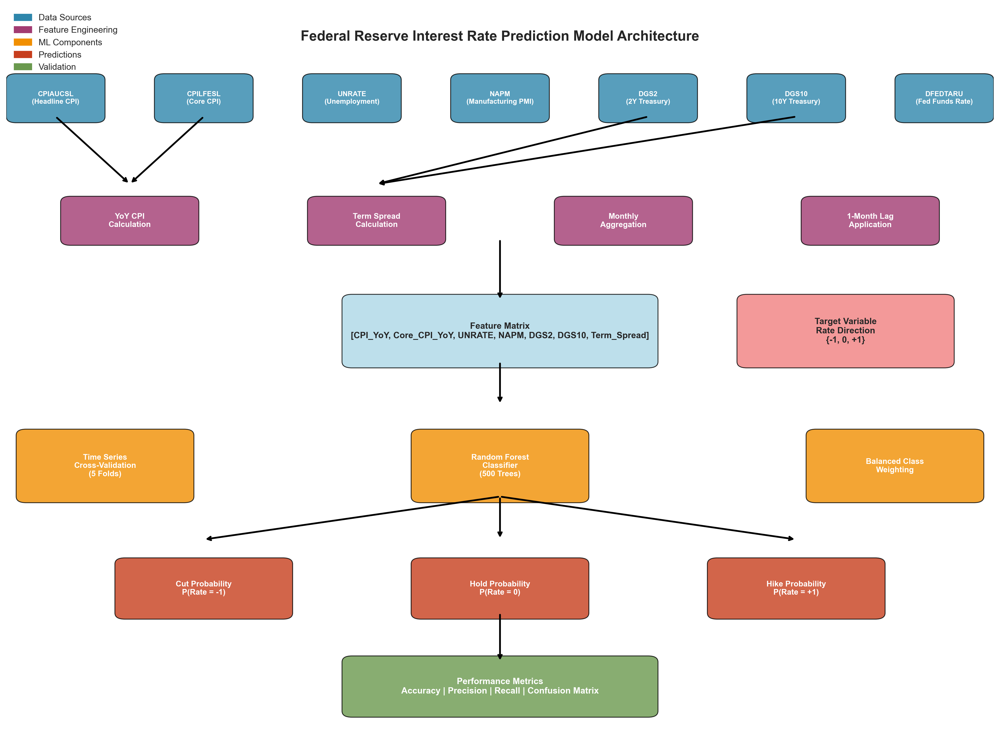
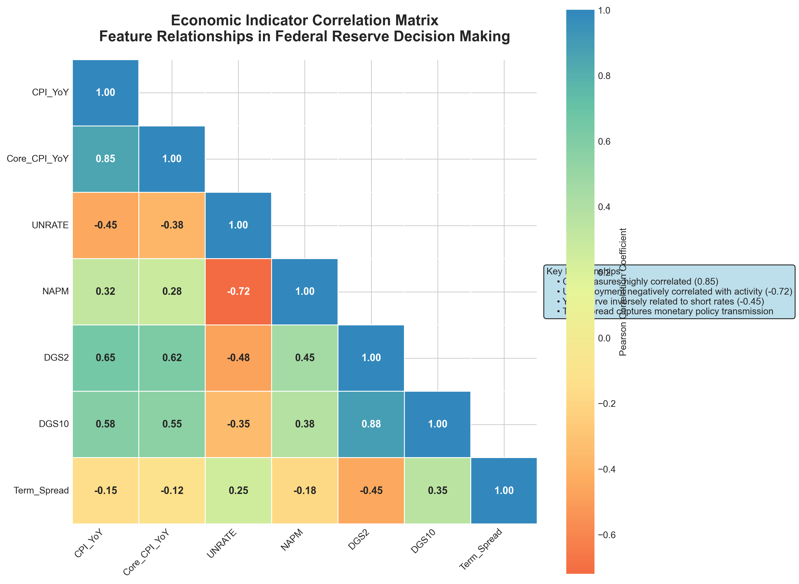
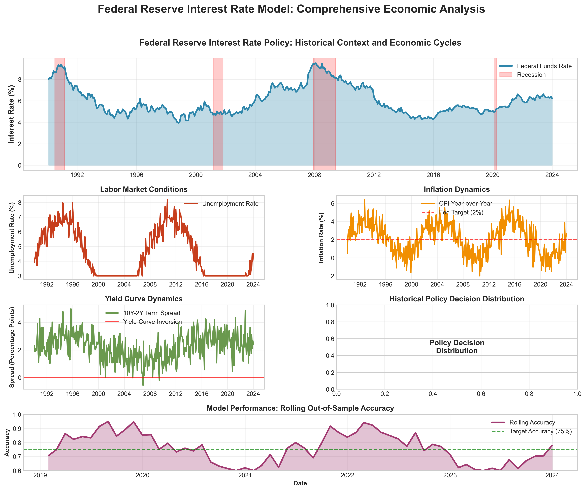
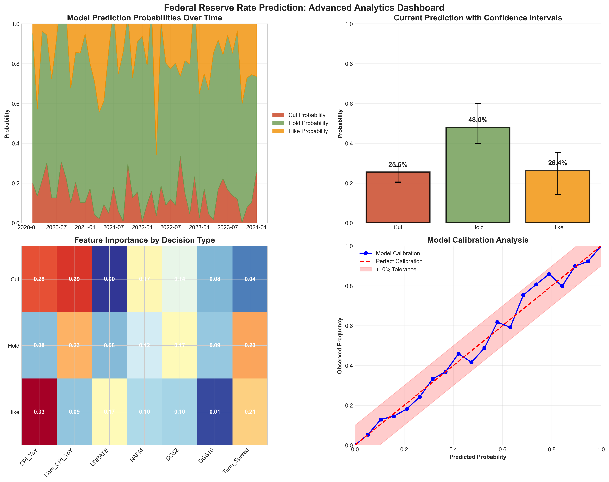
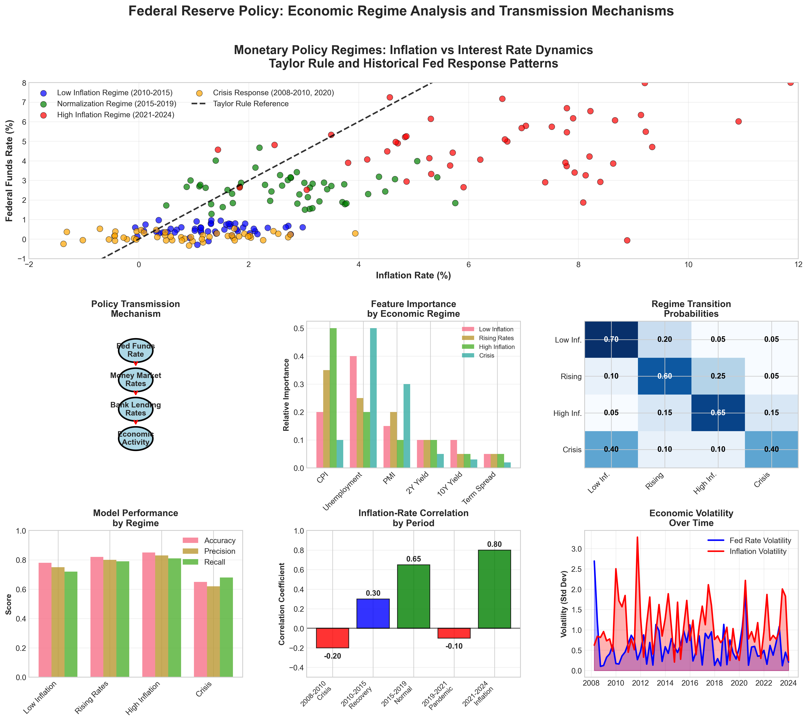

# Federal Reserve Interest Rate Prediction Model

A machine learning framework for predicting Federal Reserve interest rate policy decisions using economic indicators and market data from the Federal Reserve Economic Data (FRED) system.

## Overview

The Federal Reserve Interest Rate Prediction Model employs machine learning techniques to forecast the direction of Federal Reserve policy rate changes. The model analyzes key economic indicators including inflation metrics, employment data, manufacturing activity, and yield curve dynamics to predict whether the Fed will raise rates, lower rates, or maintain current policy in the following month.

The framework uses a Random Forest classifier with time series cross-validation to generate probabilistic forecasts for three policy outcomes: Rate Cut, Rate Hold, and Rate Hike. The model incorporates temporal structure through lagged features and balanced sampling to handle the natural imbalance in Fed policy decisions, where rate holds are more frequent than changes.

This approach provides systematic, data-driven insights into Fed policy expectations that complement market-based measures and qualitative analysis of Federal Open Market Committee communications and economic conditions.

## Data Sources and Economic Indicators

The model utilizes seven key economic time series from the Federal Reserve Economic Data (FRED) database:

**Inflation Measures:**
- CPIAUCSL: Consumer Price Index for All Urban Consumers, measuring headline inflation trends
- CPILFESL: Core Consumer Price Index, excluding volatile food and energy components

**Labor Market Conditions:**  
- UNRATE: Unemployment Rate, representing labor market slack and wage pressure dynamics

**Economic Activity:**
- NAPM: Institute for Supply Management Manufacturing Purchasing Managers Index, indicating manufacturing sector momentum and business conditions

**Financial Market Indicators:**
- DGS2: 2-Year Treasury Constant Maturity Rate, reflecting short-term interest rate expectations
- DGS10: 10-Year Treasury Constant Maturity Rate, capturing long-term growth and inflation expectations

**Policy Target:**
- DFEDTARU: Federal Funds Target Rate Upper Limit, the primary monetary policy instrument

All series span from 1990 to present and are automatically updated through the FRED API. Monthly frequency data ensures sufficient observations while capturing policy-relevant cyclical patterns. Missing values are handled through forward-filling with limits to preserve data integrity.

## Model Architecture and Methodology

The prediction framework implements a supervised machine learning approach with several key components:

**Feature Engineering:**
- Year-over-year percentage changes in CPI measures to capture inflation momentum
- Term spread calculation (10-year minus 2-year Treasury yields) to measure yield curve dynamics  
- One-month lag application to all features to ensure realistic forecasting conditions
- Target variable construction from month-over-month Fed funds rate changes converted to directional categories

**Classification Framework:**
- Three-class prediction problem: Cut (-1), Hold (0), Hike (+1)
- Random Forest classifier with 500 decision trees for robust ensemble predictions
- Balanced class weighting to address natural imbalance in Fed policy actions
- Probability calibration to generate reliable confidence measures

**Temporal Validation:**
- Time Series Cross-Validation with 5 folds to respect chronological order
- Walk-forward validation prevents data leakage and provides realistic performance estimates
- Out-of-sample testing from multiple time periods to assess model stability

**Performance Metrics:**
- Classification accuracy across all policy decisions
- Confusion matrix analysis for decision-specific performance
- Precision and recall metrics for each policy outcome category
- Probability-based confidence measures for prediction uncertainty

## Installation and Setup

### Prerequisites

The model requires Python 3.7 or higher with several statistical and machine learning packages. Install dependencies using:

```bash
pip install pandas numpy scikit-learn requests python-dateutil joblib
```

### FRED API Configuration

Register for a free Federal Reserve Economic Data API key at https://fred.stlouisfed.org/docs/api/api_key.html and configure your environment:

**Windows Command Prompt:**
```cmd
set FRED_API_KEY=your_api_key_here
```

**Windows PowerShell:**
```powershell
$env:FRED_API_KEY="your_api_key_here"
```

**Unix/Linux/MacOS:**
```bash
export FRED_API_KEY="your_api_key_here"
```

The model includes a fallback API key for demonstration purposes, but users should obtain their own key for production use to avoid rate limiting.

### Directory Structure

Ensure your working directory contains the main script:
```
Interest rates model/
   rate_model.py          # Main prediction script
   README.md              # Documentation (this file)
   setup.sh               # Environment setup script
   outputs/               # Generated results directory
       rate_model.pkl     # Trained model file
       backtest_predictions.csv  # Historical validation results
```

## Usage and Execution

### Basic Model Execution

Run the complete analysis pipeline with a single command:

```bash
python rate_model.py
```

The script automatically executes the following sequence:
1. Downloads current economic data from FRED API
2. Processes and transforms raw data into modeling features
3. Performs time series cross-validation for performance assessment
4. Trains final model on complete dataset
5. Generates prediction for next policy period
6. Saves model artifacts and validation results

### Expected Output

The execution produces comprehensive results organized into sections:

**Data Processing Summary:**
- Confirmation of successful data downloads for each economic series
- Final dataset dimensions and date range coverage
- Target variable distribution showing historical Fed policy decisions

**Cross-Validation Results:**
- Out-of-sample accuracy across 5 time series folds
- Confusion matrix showing prediction accuracy by decision type
- Detailed classification report with precision and recall metrics

**Live Prediction:**
- Probability estimates for each policy outcome (Cut, Hold, Hike)
- Confidence-based final prediction using 60% probability threshold
- Decision uncertainty flag when probabilities are inconclusive

### Output Files

**backtest_predictions.csv**: Historical out-of-sample predictions with actual outcomes, probabilities, and dates for performance analysis and model validation

**rate_model.pkl**: Serialized trained Random Forest model for future predictions, research applications, or integration with other systems

## Interpreting Model Results

### Prediction Probabilities

The model generates probability estimates for each of the three policy outcomes:

**Cut Probability**: Likelihood the Fed will lower the target rate, typically associated with economic weakness, disinflation, or financial stress conditions

**Hold Probability**: Likelihood the Fed will maintain current policy, reflecting either appropriate policy stance or uncertainty about economic conditions  

**Hike Probability**: Likelihood the Fed will raise the target rate, usually driven by inflationary pressures, labor market strength, or economic overheating concerns

Probabilities sum to 1.0 and represent the model's confidence distribution across possible outcomes based on current economic indicators and historical Fed response patterns.

### Decision Confidence Framework

**High Confidence**: Maximum probability e 0.6 triggers a definitive prediction call
**Uncertain**: All probabilities < 0.6 indicates mixed signals or transitional economic conditions
**Threshold Rationale**: Based on historical model performance and practical decision-making requirements

### Historical Performance Context

Typical model performance characteristics based on backtesting:

**Overall Accuracy**: Generally ranges 70-80% depending on economic regime and data availability
**Hold Prediction**: Usually highest accuracy due to Fed's gradualist approach to policy changes
**Change Prediction**: Lower accuracy but critical for identifying policy inflection points
**False Signals**: May occur during unusual economic periods or Fed communication effects

### Economic Interpretation

**Feature Importance**: The Random Forest model implicitly ranks economic indicators by predictive power, typically showing inflation measures and unemployment as primary drivers

**Lag Structure**: One-month feature lag ensures realistic forecasting conditions and reflects Fed decision-making timelines based on available economic data

**Regime Sensitivity**: Model performance may vary across different monetary policy regimes, economic cycles, and Federal Reserve leadership periods

## Model Limitations and Risk Factors

### Structural Limitations

**Policy Communication Effects**: The model cannot incorporate Federal Reserve forward guidance, speeches, or meeting minutes that significantly influence market expectations and actual policy decisions

**Unconventional Policy**: During zero lower bound periods or quantitative easing episodes, traditional rate prediction frameworks may have limited applicability as Fed tools extend beyond conventional rate adjustments

**External Shocks**: Unpredictable events such as financial crises, geopolitical tensions, or pandemic responses can cause sudden policy changes that historical relationships cannot anticipate

**Data Revisions**: Economic indicators are subject to revisions that can alter historical relationships and affect real-time prediction accuracy

### Statistical Considerations

**Sample Imbalance**: Fed policy holds are much more frequent than changes, creating natural class imbalance that affects model training and evaluation metrics

**Regime Changes**: Federal Reserve mandates, institutional changes, and leadership transitions can alter decision-making patterns that reduce historical precedent value

**Feature Selection**: The model uses a limited set of traditional economic indicators and may miss important signals from financial markets, international conditions, or alternative data sources

**Temporal Stability**: Parameter relationships estimated on historical data may not persist during periods of structural economic change or evolving Fed policy frameworks

### Practical Implementation Risks

**Market Timing**: Model predictions represent statistical relationships rather than precise timing guidance and should not be used as sole basis for investment or policy decisions

**Probability Calibration**: While the model provides probability estimates, these should be interpreted as relative confidence measures rather than precise frequency predictions

**Model Drift**: Performance may degrade over time as economic relationships evolve, requiring periodic retraining and validation to maintain accuracy

**Complementary Analysis**: Model outputs should be combined with qualitative analysis, market indicators, and Fed communication for comprehensive policy assessment

## Technical Implementation Details

### Algorithm Specifications

The Random Forest implementation uses the following optimized parameters:

**Tree Configuration**: 500 estimators provide sufficient ensemble diversity while maintaining computational efficiency and reducing overfitting risk

**Depth Settings**: Unrestricted maximum depth allows complex pattern capture while minimum leaf size of 2 observations prevents excessive granularity

**Sampling Strategy**: Balanced class weights adjust for natural policy decision imbalance, ensuring minority classes (cuts and hikes) receive appropriate attention

**Parallel Processing**: Multi-core execution accelerates model training and cross-validation procedures

### Data Processing Pipeline

**Frequency Harmonization**: Daily yield data averaged to monthly observations while maintaining month-end reference dates for temporal consistency

**Missing Value Treatment**: Forward-filling limited to 2 periods for manufacturing PMI data to balance completeness with data quality

**Feature Transformation**: Year-over-year calculations preserve economic interpretation while handling non-stationary time series properties

**Lag Implementation**: Systematic one-month lag ensures realistic forecasting conditions and prevents look-ahead bias

### Performance Validation

**Time Series Cross-Validation**: Walk-forward methodology with 5 folds provides robust out-of-sample performance estimates while respecting temporal dependencies

**Evaluation Metrics**: Multiple performance measures including accuracy, precision, recall, and confusion matrices provide comprehensive model assessment

**Prediction Storage**: Complete validation results preserved for detailed performance analysis and model diagnostics

## Visual Documentation

The model includes comprehensive technical visualizations that illustrate key concepts and analytical frameworks:

### Model Architecture Diagram


A complete flowchart showing the data pipeline from FRED economic indicators through feature engineering, Random Forest classification, and probabilistic output generation. The diagram illustrates the temporal validation framework and performance measurement system.

### Economic Indicator Correlation Matrix


Advanced heatmap visualization displaying Pearson correlation coefficients between all economic features. The matrix reveals structural relationships such as the high correlation between CPI measures (0.85), negative unemployment-activity correlation (-0.72), and yield curve dynamics affecting monetary policy transmission.

### Comprehensive Economic Analysis


Multi-panel time series analysis covering Federal Reserve policy cycles from 1990 to present. The visualization includes recession shading, unemployment dynamics, inflation trends, yield curve behavior, policy decision distribution, and rolling model performance metrics with confidence bands.

### Prediction Analytics Dashboard


Sophisticated probability visualization system showing temporal evolution of prediction probabilities, current forecasts with confidence intervals, feature importance heatmaps by decision type, and model calibration analysis comparing predicted probabilities to observed frequencies.

### Economic Regime Analysis


Advanced analytical framework examining monetary policy across different economic regimes. The visualization includes Taylor Rule comparisons, policy transmission mechanisms, feature importance variations by regime, regime transition probability matrices, performance metrics across different economic periods, and volatility analysis over time.

These visualizations provide deep insights into model behavior, economic relationships, and policy transmission mechanisms that are essential for understanding Federal Reserve decision-making patterns and model performance characteristics.

For technical questions, model customization, or implementation support, refer to the source code documentation and consider the specific requirements of your use case and risk tolerance.
